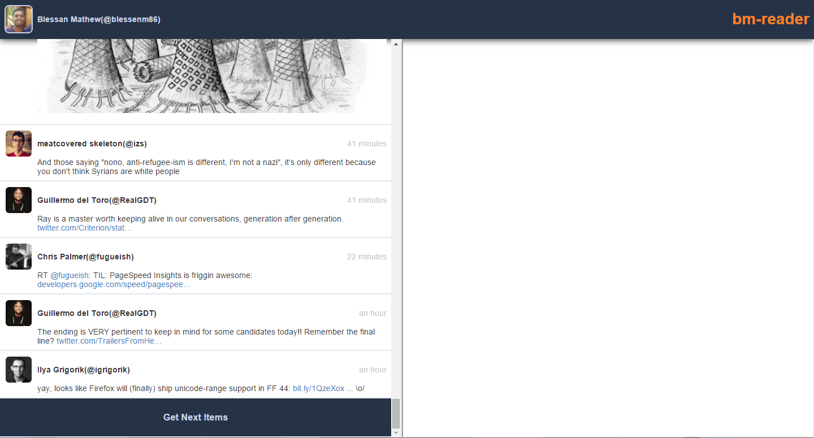

# twitter-bm-reader
Read tweets in your timeline that came after the last one you read. TBMR will continuously save the incoming tweets for you to read later. I was missing many informational tweets just because I didn't get time to check twitter everyday. This is my solution to it.



Follow the below steps to run the app

1. `git clone `
2. `npm install`
3. Go to `https://apps.twitter.com/` to create a new app. Use the key and secret of the app for the next step.
4. Create a file `grant-oauth.json` and save inside the `/config/` folder. The contents of the file are
```javascript
{
  "server": {
    "protocol": "http",
    "host": "localhost:3000",
    "transport": "session"
  },
  "twitter": {
    "key": "YOUR APP KEY",
    "secret": "YOUR APP SECRET",
    "callback": "/twitter/authorised/"
  }
}
```
3. `npm start`
4. Go to `http://localhost:3000/`

### In case there is an issue with the rendering of a tweet on the client side, report the issue to [__tweet-to-html__](https://github.com/blessenm/tweet-to-html "tweet to html") repo.

##Issues Or Contributions

* Post issues/enhancements in the github issue tracker.
*  My email is blessenm@gmail.com
*  Pull requests are welcome.
*  [__Follow Me On Twitter__](https://twitter.com/blessenm86 "Follow Me On Twitter")
*  [__LinkedIn Pofile__](http://in.linkedin.com/pub/blessan-mathew/24/605/730 "LinkedIn Profie")
*  [__Stack Overflow Pofile__](http://stackoverflow.com/users/548568/blessenm "Stack Overflow Pofile")
